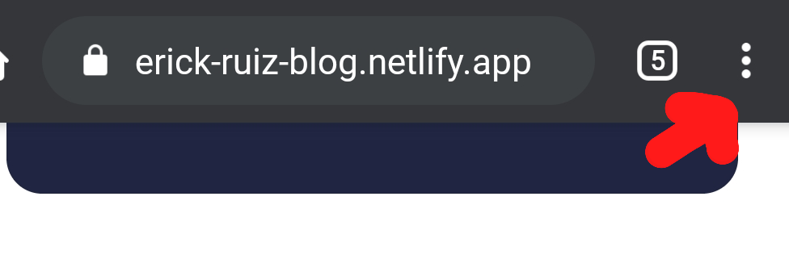
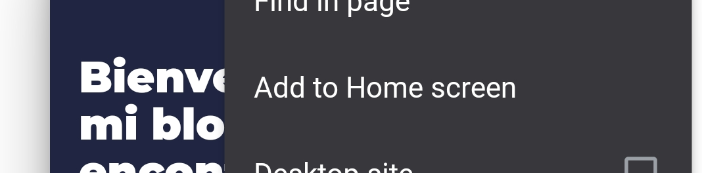
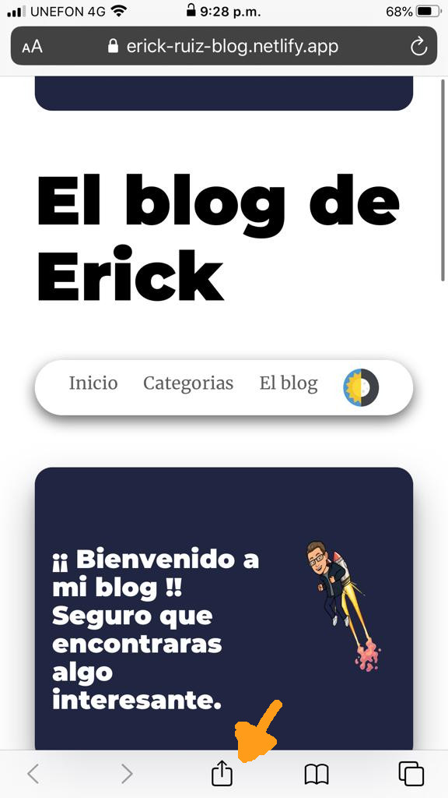
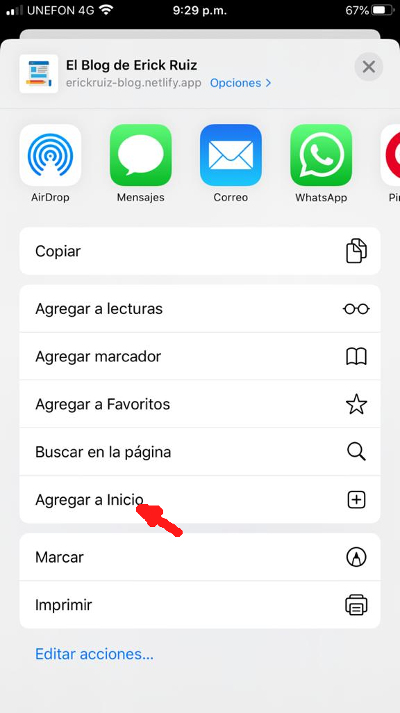
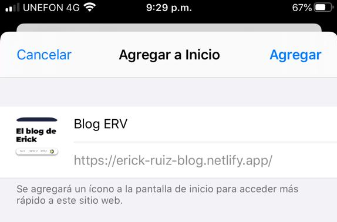
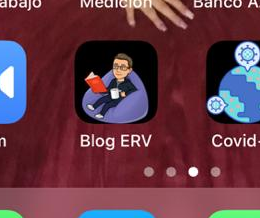

El blog está creado para poder leerlo en cualquier lugar y sin tener acceso a internet, te dejo los pasos para que puedas añadir este blog a tu pantalla si estas en tu teléfono Android o IOS.

##Aquí tienes los pasos a seguir
###En Android

- Si tienes la siguiente opción de "añadir a tu pantalla" en la parte inferior utilízalo(si no ve el siguiente punto), haz clic y visualízalo en tu pantalla principal.

    - 

- Pulsa el botón de ajustes (los tres puntitos arriba a la derecha).

    - 

- Selecciona "Añadir a la pantalla de inicio".

    - 

- Por defecto aparecerá el nombre de la web, pero puedes cambiarlo si lo deseas.
- Pulsa en "Añadir automáticamente".

###En IOS

- Pulsa el botón de compartir (el icono central de la barra inferior).

  - 

- Selecciona "Agregar al inicio".

    - 

- Aparecerá el nombre por defecto de la web, pero puedes cambiarlo a placer.
- Pulsa "Agregar".

    - 

###Listo  tendrás el blog en tu teléfono para ingresar cuando quieras.
Solo recuerda que tendras que actualizar la pagina para ver los nuevos post

