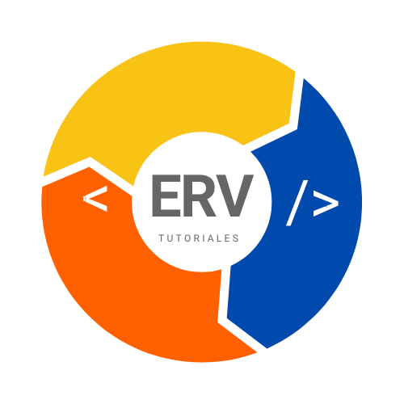

##Mi canal de YouTube

Hola de nuevo, hoy te mostraré un poco sobre lo que me gusta compartir y que contenido subo, a demás de contarte como es que nació este canal.

Primero que nada te dejo mi canal por si quieres visitarlo y ver el contenido tengo buenos videos para que vayas conociendo un poco más otro sistema operativo.

#### checa el  canal ->> [Linux con Erick](https://www.youtube.com/channel/UCGLuuccCgpbBrPB_NBD1FGw)

Mi canal se llama __prende linux con Erick__, el tema central como puedes imaginarte es LINUX y en especial ocupamos Ubuntu para conocer linux de una manera más amigable. Llevo algún tiempo utilizando linux como sistema operativo principal de mi laptop y decidí que puedo ayudar a usuarios a decidirse a cambiarse de sistema operativo.

Pero este canal no nació así de la nada, la universidad me llevo a subir videos tutoriales de linux o probando software y documentando y es ahí en donde decidí crear un canal aprovechando que subiría esos videos. 

**Pero hace un tiempo ya tenía videos de Ubuntu**

Hace como 5 años grabe de igual forma videos sobre como instalar Ubuntu y los primeros pasos sobre como utilizar este sistema operativo y nunca me anime a subir los videos por pena, pero me dejo una increíble enseñanza, siempre has lo que a ti te apasione sin importar lo que digan los demás, pues ahora ya hago lo que me apasiona esta mi canal y ahora mi blog a demas de Kodbox te lo dejo por aqui [Que es Kodbox](https://erick-ruiz-blog.netlify.app/kodbox/)