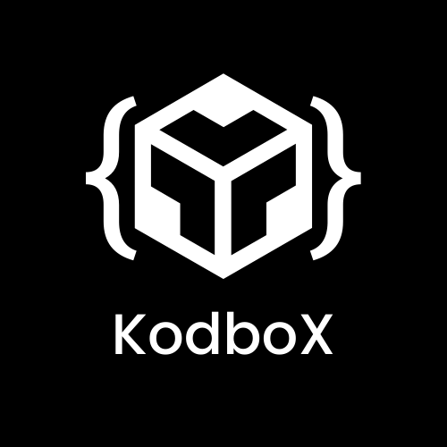

## Canal de programación

Hace un tiempo que con ayuda de mis amigos creamos un canal de YouTube en donde enseñamos a gente que apenas empieza en el mundo de la programación algunos temas relevantes o a la gente que busca temas un poco avanzadas también, ya que nos dimos cuenta de que para algunos casos falta contenido de donde consultar en español.

#### Ve a nuestro canal y mira los videos seguro que aprenderás algo. 

El canal [KodBox](https://www.youtube.com/channel/UCoEIYAsPco1b1AKyDDVi3fg)
y nuestro Twitter [KodBox Twitter](https://twitter.com/KodboX_)

¿Quiénes son con los que colaboro en Kodbox?

- Te dejo sus Twitter por si quieres seguirlos.
    - [Abraham](https://twitter.com/AbrahamAzaelmr)
    - [Luis](https://twitter.com/luis_Blash)
    - [Miguel](https://twitter.com/Miguel21531956)

También te dejo nuestro canal de juegos que apenas empezamos

 - [Kodbox Gaming](https://www.youtube.com/channel/UCQqZyAllhCB5ljzRnNDKQLw)